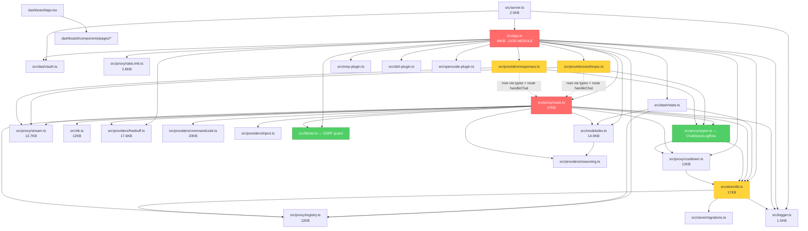

# Dependency Graph — troy

Generated: 2026-09-02 (updated post quick-wins) | Source: static import parse (69 files)

## Module Import Graph



## Layering & Direction

```
Entry:       src/server.ts -> src/app.ts
Orchestrator: src/app.ts (hub) -> all layers
Dashboard:   dashboard/* (isolated, only React + api.ts -> HTTP)
Store:       src/store/db.ts + migrations.ts
Proxy:       src/proxy/{route,stream,cooldown,registry,rateLimit,types} + src/rtk.ts + src/lib/net.ts
Providers:   src/providers/{anthropic,responses,freebuff,reasoning,commandcode,inject}
Plugins:     src/omp-plugin.ts, src/dsh-plugin.ts, src/opencode-plugin.ts
Shared:      src/logger.ts, src/modelsdev.ts, src/dash/*
Tests:       test/* -> src/*
```

## Cycles & Layering Violations

| Edge | Severity | Status | Note |
|------|----------|--------|------|
| providers/anthropic.ts -> proxy/route.ts | **HIGH** | **PARTIAL FIX** | Now `providers/anthropic.ts` imports `ChatDeps` from `proxy/types.ts` (type-only); `handleChat` still from `route.ts` — remaining coupling is runtime, next step inject `handleChat` via `ChatDeps` or app wiring to fully break. |
| providers/responses.ts -> proxy/route.ts + proxy/stream.ts | **HIGH** | **PARTIAL FIX** | Same: `ChatDeps` now from `types.ts`; `handleChat` + `stream` remain. |
| store/db.ts -> proxy/registry.ts | **MEDIUM** | OPEN | Store (low) imports mid `registry` type — move `Provider` to shared `src/types/provider.ts` (M). |
| app.ts:90 / route.ts:43 `isPrivateHostname` dup | **MED** | **FIXED** | Deduplicated to `src/lib/net.ts` (Q1). |
Cycle closure: previously `route -> anthropic/responses -> route`; now `ChatDeps` via `types.ts` reduces type-coupling, but runtime `handleChat` edge remains — full break needs injection (see `docs/OPTIMIZATION.md`).

## Quick-Wins Applied (2026-09-02)

| Win | File | Change |
|-----|------|--------|
| Q1 | `src/lib/net.ts` (new) | Extracted `isPrivateHostname` + `assertPublicUrl` from `app.ts:90-124` / `route.ts:43-61` |
| Q2 | `src/proxy/types.ts` (new) | `ChatDeps`/`LogRow` moved from `route.ts`; providers now import types, not router |
| Q3 | `src/app.ts` | `json()` no default CORS `*`, `readBody` pathname-based, `clientIp` gated by `TROY_TRUST_PROXY`, `providerModelsCache` FIFO 100 |

## Size Hotspots

| Rank | File | Size |
|------|------|------|
| 1 | src/app.ts | 48KB (1,245 lines) |
| 2 | src/proxy/route.ts | 27KB |
| 3 | src/providers/commandcode.ts | 20KB |
| 4 | src/providers/freebuff.ts | 17.6KB |
| 5 | src/store/db.ts | 17KB |
| 6 | src/modelsdev.ts | 14.9KB |

Top 2 files = 75KB (~28% of src). God-module concentration.

## External Dependency Weight

All 15 dependencies are React/dashboard UI (radix, cmdk, recharts, lucide). Zero runtime server deps beyond bun/bun:sqlite/node:* — lean. No unused deps. Dashboard pulls 29 react edges.

## Coupling Metrics

- Fan-in highest: src/logger.ts (7 importers), src/store/db.ts (6), src/proxy/registry.ts (6).
- Fan-out highest: src/app.ts (15), src/proxy/route.ts (11).
- Blast radius: app.ts or route.ts break covers entire proxy.

## Raw Adjacency JSON

See docs/GRAPH.json (full 69-file adjacency).
